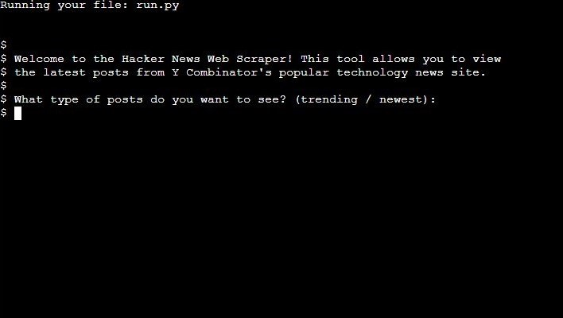
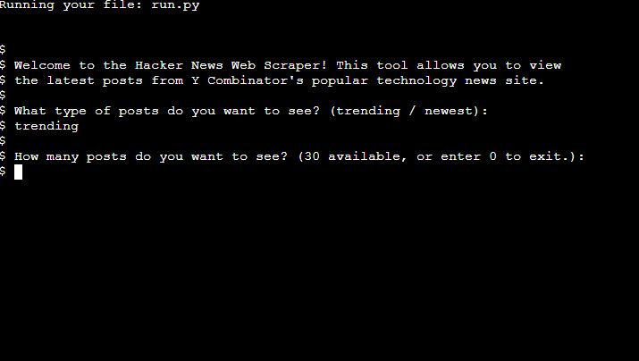
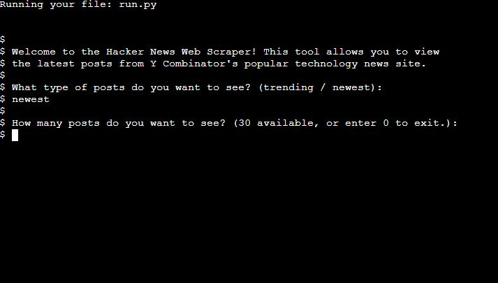
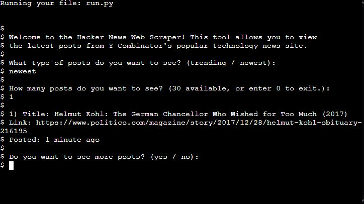
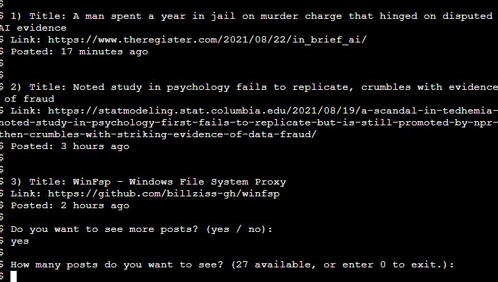

# Hacker News Scraper Testing Details

All code was validated using pep8online, with the only remaining error being a "line too long" error in run.py. I also used Autopep8 in VS Code to auto format my Python code on save. 

-   [Autopep8](https://pypi.org/project/autopep8/)
-   [Pep8 Online](http://pep8online.com/)

## Testing User Stories

-   The user wants to access Hacker News stories via the terminal.
    -   This application is run purely from the terminal, either on Code Institute's mock terminal or on a local machine. 

-   The user wants to be able to see trending stories.
    -   This application gives the user the option to choose to view trending stories from Hacker News.

-   The user wants to be able to see newest stories.
    -   The user is also able to see the most recent stories from Hacker News.

-   The user wants to choose how many stories they want to see. 
    -   The user has the ability to instruct the program to view a certain amount of posts at a time. They will then be asked if they would like to view more.

-   The user wants to see information on the stories, e.g. title, link and post age.
    -   Details about each post are displayed to the screen after the user has instructed the program how many posts they wish to view.

-   The user wants to be able to keep feeding through posts after the initial ones are displayed.
    -   After the user initially instructs the program on how many posts they wish to view, if there are still posts to be displayed the user will be asked if they wish to view more. Each list of posts (trending/newest) can be drip fed to the user as long as there are some remaining.

-   The user's input should be validated at all stages.
    -   All user input throughout the program is validated to ensure it can be correctly handled at runtime. 
    -   All number inputs are converted to integers, and all strings are converted to lowercase and checked to match the options a user is given.

## Further Testing

-   The application was tested both locally and in the deployed Heroku terminal.

-   Information in the program was compared with live data on Hacker News to ensure all data was recent and correct. 

-   Peers were also asked to test the application for point out existing errors.

## Bugs

-   There are no major remaining bugs in the program. 

-   Line lengths still go over the recommended 80 character limit. This is minor, and really a none-issue in modern terminals. 

-   Printing to the Heroku terminal required a couple of workarounds, as code needed to be committed and pushed just to test this. 